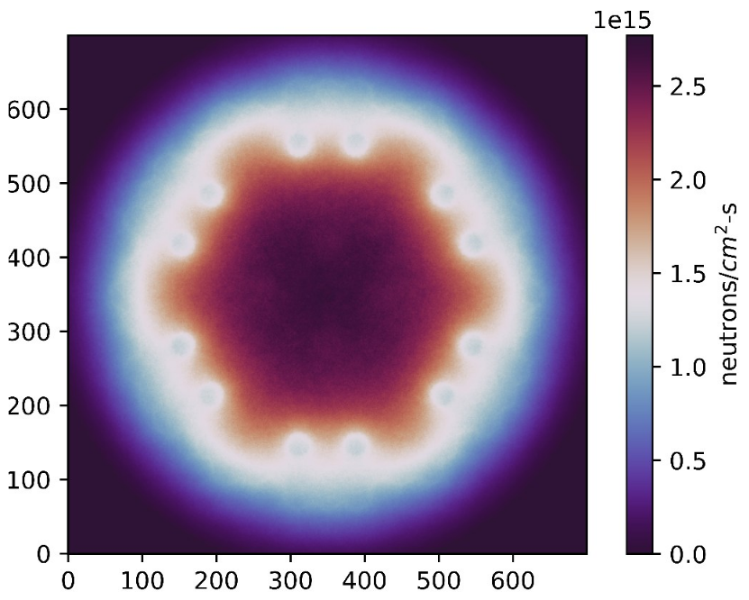
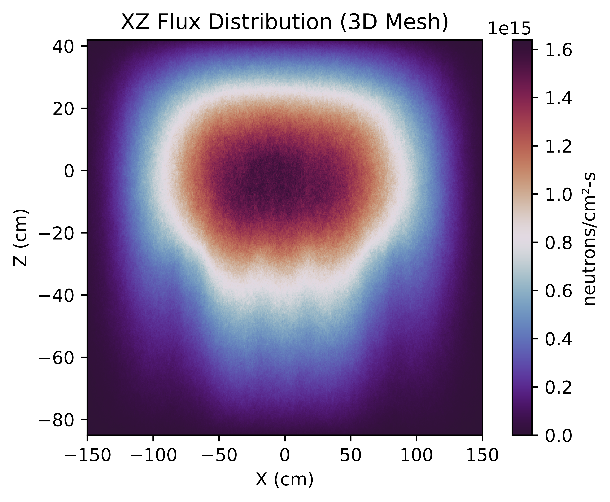
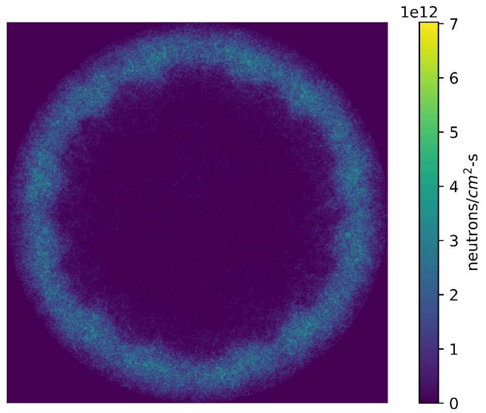
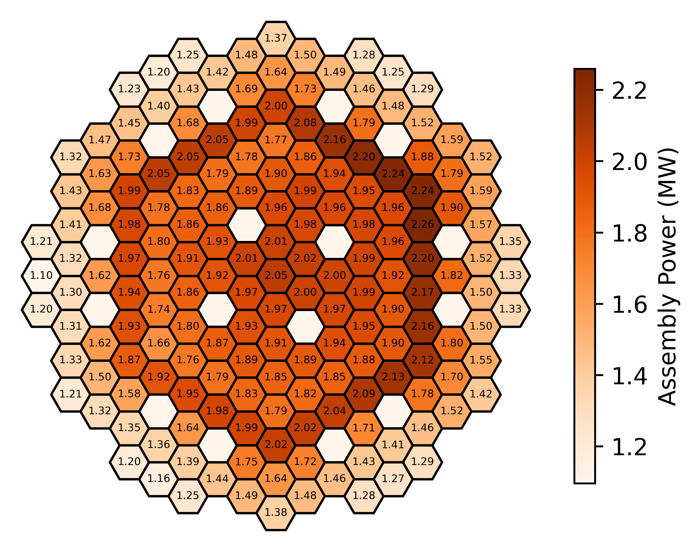

  

## Overview

For my undergraduate thesis i wanted to study Lead Cooled Fast Reactors and chose the [ALFRED](https://www.sciencedirect.com/science/article/abs/pii/S0029549314004361) model to condcuct a neutronics analysis. ALFRED is a prototype for next-generation Lead-Cooled Fast Reactors (LFRs). It aims to demonstrate enhanced safety and efficiency for nuclear energy.

In this project i designed the ALFRED core using [OpenMC](https://docs.openmc.org/en/stable/) and conducted analysis on several parameters such as criticality (keff), neutron flux, power distribution, fuel burnup, actinide production and coolant activation. This work provided insights into the reactor’s performance and validated its design. 

## Snapshots:

  

    
    
<strong>Radial Neutron Flux</strong>

  

  

    
    
<strong>Axial Neutron Flux</strong>

  

  

    
    
<strong>Thermal Neutron Flux</strong>: Observed around the reflector region.

  

  

    
    
<strong>Power Distribution</strong>

  

## Code and Resources

Explore some of the detailed codebase and analysis on [GitHub](https://github.com/SShuddho/neutronics-alfred).
