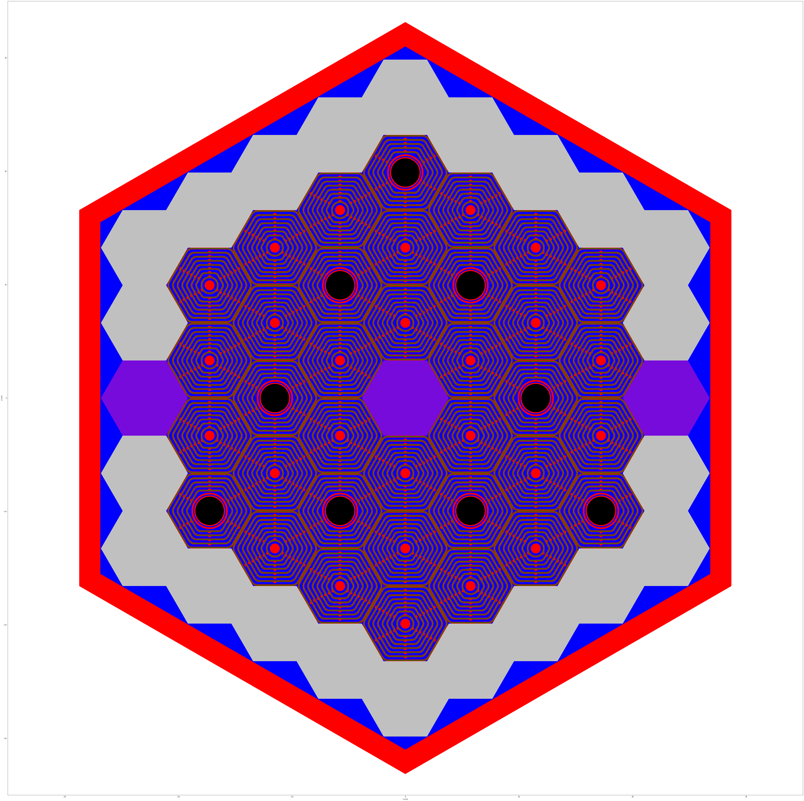
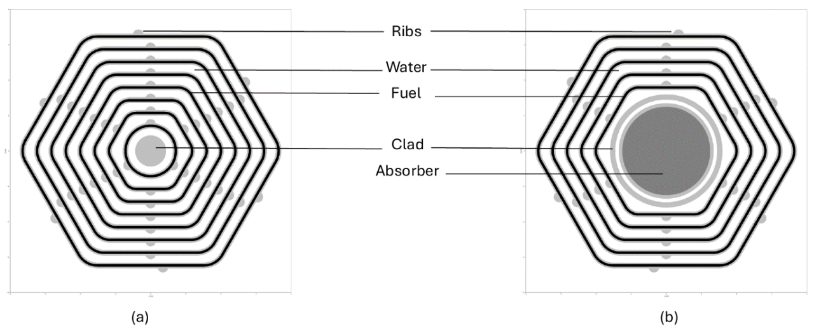

  

## Overview

Bangladesh is exploring a 10-20 MW Multi-Purpose Research Reactor (MPRR) using [VVR-KN](https://link.springer.com/article/10.1007/s10512-017-0294-0) type low-enriched uranium fuel, aligning with global non-proliferation standards. This project takes the conceptual design from [Nguyen et al. (2020)](https://onlinelibrary.wiley.com/doi/10.1155/2020/7972827) and attempted a preliminary analysis of a reactor that uses VVR-KN type fuel.

The VVR-KN fuel, utilized in the MPRR, features an interesting hexagonal plate-type design with eight coaxial fuel elements, plus a five-tube variant for control rod placement. The fuel element is in a SAV-1 aluminum alloy cladding for durability and heat transfer. This LEU fuel minimizes proliferation risks while supporting high neutron fluxes for research applications like radioisotope production.

These are the two desinged fuel assembly variants:

  

    
    
<strong>FA-1 (a) and FA-2 (b) </strong>

  

