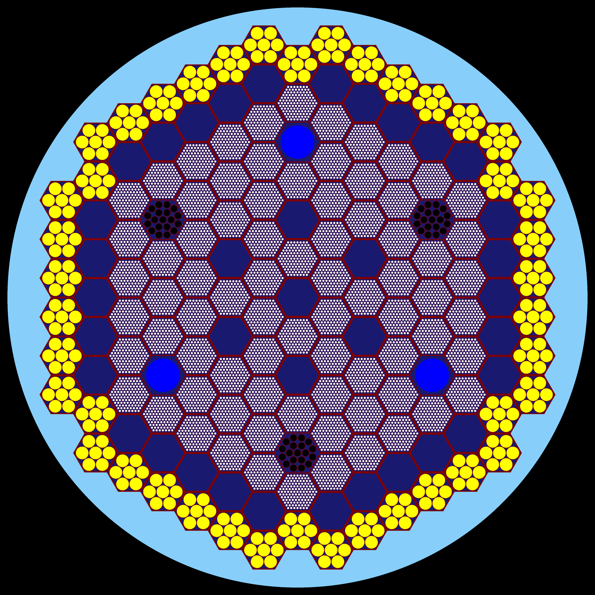

  

## MYRRHA Project Overview
[MYRRHA](https://esfr-smart.eu/wp-content/uploads/2021/04/S51_2_Didier_De_Bruyn_The_MYRRHA_Project_ESFR_SMART_Summer_School_V3.pdf) (Multipurpose hYbrid Research Reactor for High-tech Applications) is an innovative accelerator-driven system (ADS) being developed by SCK CEN in Belgium. Designed to demonstrate spent nuclear fuel transmutation, produce medical radioisotopes, and advance fusion material research, MYRRHA aims to support sustainable nuclear energy and cutting-edge scientific applications.

I am currently working with the latest subcritical MYRRHA model (Revision 1.8), which optimizes the reactor design for reduced size, cost, and enhanced safety. The core model of this project is still under development.
